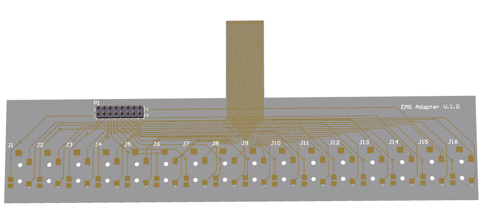

# EMG Sensor Electrode Adapter
This is an adapter for this Multichannel EMG Sensor: [Multichannel EMG Sensor](./../../../../emg-sensor_board) 

The adapter can be used to connect Audio Jack based electrodes to the multichannel EMG.

## License
For open source projects, say how it is licensed.

## Project status

